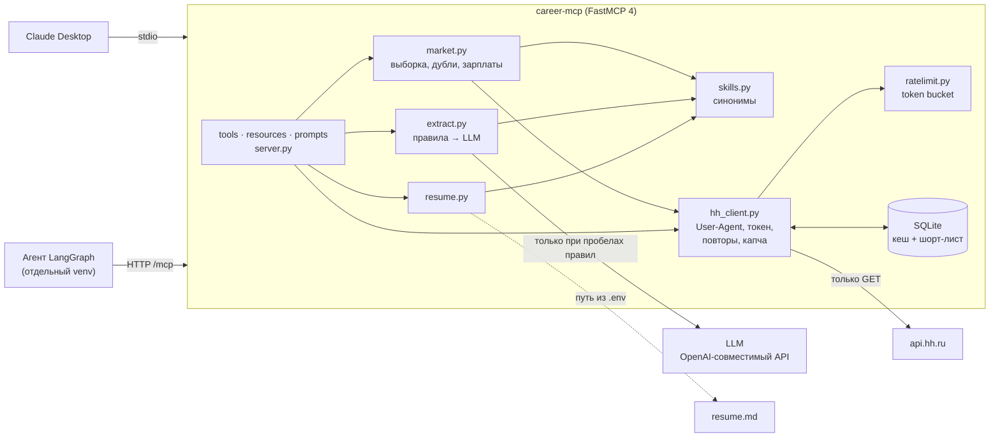

# career-mcp

MCP-сервер на FastMCP 4 к официальному API hh.ru. Через него Claude Desktop или свой агент на LangGraph может:

- искать и читать вакансии;
- делать срез рынка по роли и городу: сколько вакансий, какие навыки просят, какие зарплаты;
- сравнивать резюме с вакансией и с рынком;
- составлять план подготовки к собеседованию.

Сервер только читает hh.ru. Откликов, сообщений работодателям и изменений резюме на сайте он не делает — почему так, объяснено в [DECISIONS.md](DECISIONS.md).

> **Статус на 2026-09-24.** С апреля 2026 hh.ru не отдаёт вакансии без токена приложения. Заявка #29673 на dev.hh.ru на рассмотрении. До её одобрения работают справочники, резюме, шорт-лист и LLM, а поиск честно отвечает «нужен HH_ACCESS_TOKEN». Весь код проверен тестами на синтетических ответах, собранных по официальной спецификации hh.

## Архитектура



Запрос проходит так: инструмент → бизнес-логика → `HHClient`. Клиент сначала смотрит в кеш. На промахе берёт токен у ограничителя частоты, делает запрос, при 429/5xx повторяет, при капче или 403 останавливается. Ошибки hh превращаются в понятный модели текст (`ToolError`), а не в стек-трейс.

## Что умеет сервер

| Tool | Что делает |
|---|---|
| `search_vacancies` | Поиск. Город принимается названием, опыт и формат работы — словами («нет опыта», «удалённо»). Сжатый список, `per_page ≤ 50`. |
| `get_vacancy` | Текст без HTML, разбитый на разделы (обязанности, требования, «будет плюсом», условия), key_skills, подозрительные строки |
| `market_snapshot` | Срез рынка: распределения, зарплаты (медиана и квартили с размером выборки), топ-20 навыков, дубли считаются один раз |
| `extract_requirements` | `must_have`, `nice_to_have`, `stack`, `grade`, `english`, `tasks`. Сначала правила, LLM — только для пробелов. |
| `match_resume` | Покрытие обязательных навыков резюме, чего не хватает, что есть сверх требований |
| `skill_gap` | Навыки рынка, которых нет в резюме, по убыванию частоты |
| `save_vacancy`, `list_saved` | Локальный шорт-лист в SQLite — единственная запись |

**Resources:**
- `resume://current` — резюме;
- `vacancy://{id}` — полный ответ hh из кеша;
- `dict://areas`, `dict://experience`, `dict://currencies` — справочники hh;
- `skills://synonyms` — словарь синонимов навыков.

**Prompts:**
- `analyze_market(role, city)` — срез рынка и что учить;
- `prepare_for_vacancy(vacancy_id)` — подготовка к собеседованию;
- `tailor_resume(vacancy_id)` — что подчеркнуть в резюме, с жёстким запретом выдумывать опыт.

## Быстрый старт (Windows, Python 3.11+)

```bash
py -3.12 -m venv .venv
```

```bash
.venv\Scripts\python -m pip install -e ".[dev]"
```

Скопируйте `.env.example` в `.env` и заполните как минимум `HH_CONTACT_EMAIL` и `RESUME_PATH`. `HH_ACCESS_TOKEN` берётся в dev.hh.ru/admin после одобрения приложения.

Запуск для Claude Desktop (stdio) и для агентов (HTTP, эндпоинт `http://127.0.0.1:8000/mcp`):

```bash
.venv\Scripts\python -m career_mcp
```

```bash
.venv\Scripts\python -m career_mcp --transport http --port 8000
```

### Claude Desktop

Добавьте блок из [examples/claude_desktop_config.json](examples/claude_desktop_config.json) в `%APPDATA%\Claude\claude_desktop_config.json`. Настройки сервер читает из `.env` в корне проекта, независимо от того, из какой папки его запустил Claude.

### Агент на LangGraph

`langchain-mcp-adapters` требует `mcp<2`, а FastMCP 4 — `mcp>=2`, поэтому у агента своё окружение. Он ходит к серверу по HTTP:

```bash
py -3.12 -m venv examples\.venv
```

```bash
examples\.venv\Scripts\python -m pip install -r examples\requirements.txt
```

```bash
examples\.venv\Scripts\python examples\langgraph_agent.py
```

Агент решает задачу «найди вакансии ML-стажёра в Москве, посчитай, каких навыков не хватает, и составь план на две недели». У него `recursion_limit=16`, каждый вызов инструмента логируется. Проверено вживую 2026-09-24: клиент `mcp` 1.30 договорился с сервером о протоколе 2025-11-25, модель вызвала `search_vacancies` и `skill_gap`. Токена hh не было, поэтому агент честно сообщил, что данных нет, и ничего не придумал.

## Тесты

```bash
.venv\Scripts\python -m pytest
```

Все 98 тестов проходят без сети: API hh замокан через `respx`, сервер проверяется через in-memory `fastmcp.Client`, а оба транспорта — отдельным процессом.

Обязательные кейсы из ТЗ:
- повтор запроса берётся из кеша;
- на 429 с `Retry-After` сервер ждёт и повторяет;
- 404 не повторяется;
- капча — понятная ошибка без повторов;
- USD переводится в рубли;
- вакансия без зарплаты не попадает в статистику;
- дубль в двух городах считается один раз;
- Postgres и PostgreSQL — один навык.

## Метрики

В таблице только реально измеренное. Остальное ждёт токен hh и ручную разметку, скрипты для этого готовы ([eval/README.md](eval/README.md)).

| Что | Результат | Как измерено |
|---|---|---|
| Выбор LLM для извлечения требований | `free/mimo-v2.6-pro`: 7 из 7 вызовов без ошибок, 0 срабатываний инъекций | 31 модель apinex → 5 доступных → 3 раунда с подвохами. Подробно в [eval/model_selection.md](eval/model_selection.md). |
| Модель glm-5.3-flash (второе место после раунда 2) | 1 срабатывание инъекции из 7 | Там же |
| Извлечение навыков: precision и recall, «словарь + key_skills» против «+ LLM», 30 вакансий | **не измерено**: нужен токен hh и разметка | `eval/eval_extraction.py` |
| `match_resume` против моей оценки, 10 вакансий | **не измерено**: нужен токен hh и разметка | `eval/eval_match.py` |
| Доля запросов из кеша, латентность с кешем и без | **не измерено**: нужен токен hh | `eval/eval_ops.py` |

## Безопасность

- Токен hh и ключ LLM — только в `.env` (`SecretStr`). В ответы, логи и `repr` настроек они не попадают, это проверено тестом.
- Тексты вакансий — недоверенные данные. Защита многослойная: маркировка, детектор подозрительных строк, вырезание таких строк перед LLM, проверка ответа схемой, приём навыка от LLM только если он есть в тексте. Подробности в [DECISIONS.md](DECISIONS.md).
- Путь к резюме только из конфига: у инструментов нет параметра пути.
- Логи только в stderr: stdout при stdio занят протоколом.

## Структура

```
career-mcp/
├── src/career_mcp/
│   ├── server.py       # tools, resources, prompts, запуск и транспорты
│   ├── hh_client.py    # API hh: заголовки, токен, лимит, кеш, повторы, ошибки
│   ├── cache.py        # кеш с TTL и ETag в SQLite
│   ├── ratelimit.py    # token bucket
│   ├── dicts.py        # справочники: город → id, опыт, формат работы, валюты
│   ├── text.py         # HTML → текст, разделы описания, подозрительные строки
│   ├── skills.py       # синонимы, поиск навыков в тексте, эмбеддинги (опция)
│   ├── market.py       # выборка, дедупликация, зарплаты, распределения
│   ├── extract.py      # требования: правила → LLM
│   ├── llm.py          # клиент OpenAI-совместимого API
│   ├── resume.py       # резюме из Markdown
│   ├── storage.py      # шорт-лист
│   ├── prompts.py      # тексты prompts
│   ├── evaluation.py   # формулы метрик
│   ├── models.py       # модели ответов
│   └── config.py       # настройки из .env
├── data/skills_synonyms.yaml
├── tests/              # 98 тестов, фикстуры в tests/fixtures
├── eval/               # разметка, скрипты метрик, выбор модели
└── examples/           # конфиг Claude Desktop, агент на LangGraph
```
